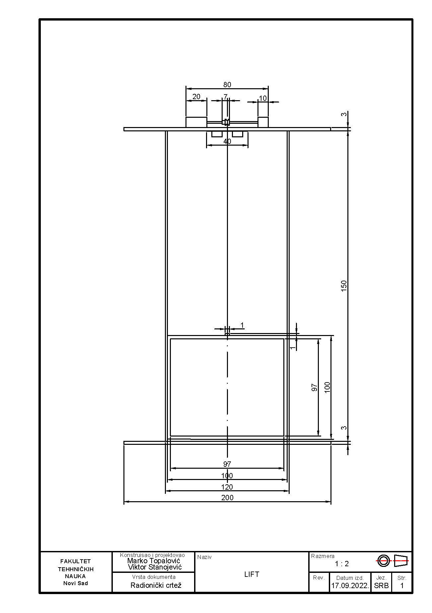
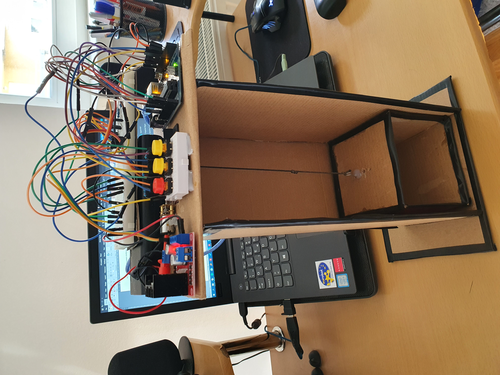
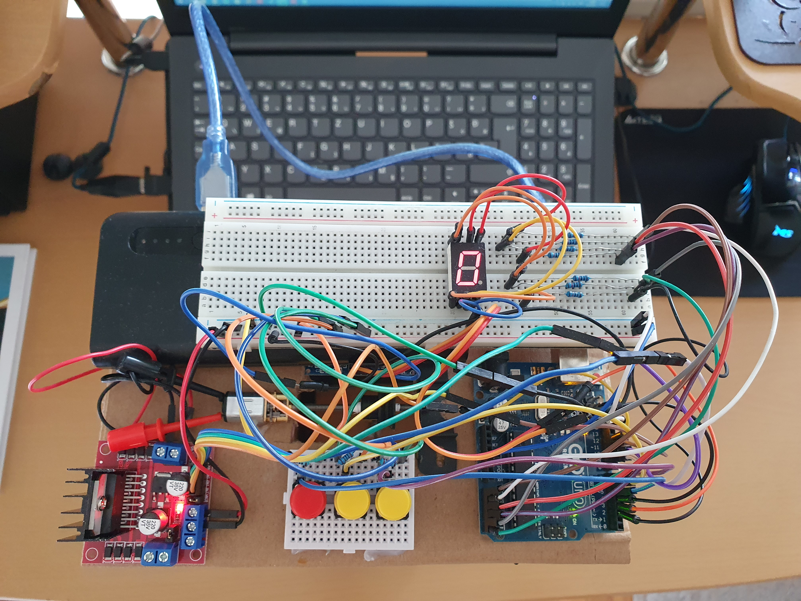
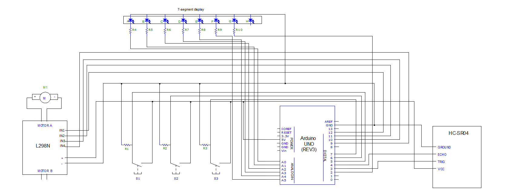

# Elevator with arduino
## Description of system operation
* Based on the sensor measurements, we calculated the distance in cm in the merenje_udaljenosti() function. To start the motor, the goreON() and goreOFF() functions are created, which are called when the elevator needs to move up, then we actually turn on/off the contacts in1 and in3 on the driver. The same is the case with the doleON() and doleOFF functions for the downward movement of the elevator. The seven-segment display shows which floor the elevator is currently on. Pressing one of the three buttons sets the corresponding Arduino pin to HIGH and depending on which button is pressed certain conditions are set to be executed:

### Button 1

By pressing button 1, the elevator is sent to the ground floor. There are 2 cases where the elevator can be found. The first is that the elevator is already on the ground floor (distance=20), then nothing happens and the elevator stays in that position. The second is that the elevator is at a certain height (distance<20), then the motor is turned on (downON()) and the distance is measured until the elevator reaches the ground floor (distance=20), when the elevator reaches the desired height the motor is turned off (downOFF ()) and the number 0 is printed on the display.

### Button 2

Pressing button 2 sends the elevator to the 1st floor. There are 3 cases in which the elevator can then be found. The first is that the elevator is already on the first floor (distance=10), then nothing happens and the elevator stays in that position. The second is that the elevator is at a height less than 10, which means that the elevator is somewhere above the first floor, then the motor is turned on (downON()) and runs until the elevator is on the first floor (distance=10). The third case is that the elevator is located at a height greater than 10, which means that the elevator is located somewhere below the first floor. Then the motor is turned on (goreON()) and it runs until we get the desired lift height. When the elevator reaches the first floor, the motor is turned off and the number 1 is displayed on the display.

### Button 3

By pressing button 3, the elevator is sent to the 2nd floor. The case is similar to button 1. If the elevator is already on the 2nd floor (distance=4), it remains in that position, if it is below that height, the motor is turned on until it reaches that position. When the elevator reaches the second floor, the number 2 appears on the display.

---

##  Technical drawing of the elevator

---

## Picture of the elevator from the front

---

## Picture of the elevator from the top

---

## Circuit diagram

---

You can watch video models of the elevator at the following link:

https://www.youtube.com/watch?v=hT3nBkbIbvs&ab_channel=MarkoTopalovi%C4%87
